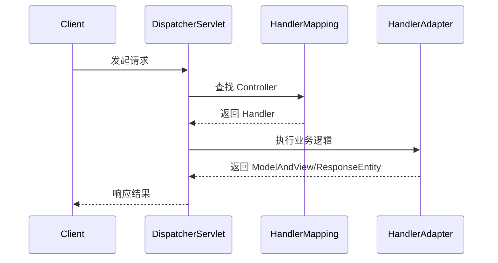

<!--more-->

## 1. 为什么 2026 年还要学 Spring？
虽然 AI 编程已经普及，但 Spring 生态依然是 Java 世界的“操作系统”。在 2026 年，Spring Boot 4.0 带来了以下质变：
* **全面拥抱 JDK 21+：** 默认支持虚拟线程（Project Loom），高并发性能提升。
* **原生 AOT 编译：** 配合 GraalVM，启动时间从秒级降至毫秒级。

## 2. Spring 核心请求流程图
理解 Spring MVC 的底层是第一步：




## 3. 今日实战：Hello World

在 Spring Boot 4.x 中，一个最简单的 RestController：

```java
@RestController
public class HelloController {
    @GetMapping("/")
    public String index() {
        return "Hello Spring 2026! 虚拟线程已就绪。";
    }
}
```

## 4. 待办清单 (Learning Path)
[ ] 彻底搞懂 IoC 与 DI 的区别

[ ] 实践 AOP 记录接口日志

[ ] 压测虚拟线程与传统线程池的区别